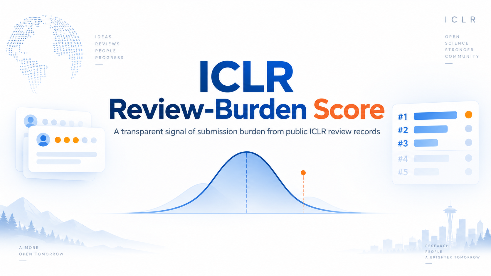

**[EN](./README.md)** | [ZH](./docs/README.zh.md)

# ICLR Review-Burden Rating



A local, offline tool that quantifies the possible review burden of low-quality submissions, built on the public [qhjqhj00/iclr-openreview-reviews](https://github.com/qhjqhj00/iclr-openreview-reviews) dataset.

> **Note on Motivation & Design**: This README provides a quick deployment guide and mathematical summary. For in-depth discussions on motivation, ethical guardrails, empirical score distributions, and why simple submission-counting fails, please check the **[Blog](http://127.0.0.1:8765/essay.html)** on the web UI homepage, or read `[docs/blog_en.md](./docs/blog_en.md)` / `[docs/blog_zh.md](./docs/blog_zh.md)`.

---


## Quick Start & Deployment

**Prerequisites**: Python 3.10+, Git, and [Git LFS](https://git-lfs.com/). No extra Python libraries are required. The program uses the standard library only.

### 1. Clone

`data/iclr.sqlite3` is stored with Git LFS. The real database is about 144 MB. GitHub's **Download ZIP** does not fetch LFS objects, so a zip leaves a small pointer file at that path and SQLite cannot open it. Clone instead:

```bash
git lfs install
git clone https://github.com/user114514114514/ICLR-Review-Burden-Rating.git
cd ICLR-Review-Burden-Rating
```

After clone, `data/iclr.sqlite3` should be about 144 MB.

### 2. Launch Web UI

```bash
python3 -m iclr_burden serve
```

Open [http://127.0.0.1:8765/](http://127.0.0.1:8765/) in your browser. The local server is strictly read-only and provides author search, annual score cards, peak-score rankings, and global score distributions.

### 3. Command-Line Queries

```bash
# Search authors by name or OpenReview Profile ID
python3 -m iclr_burden search 'Family'

# View author report
python3 -m iclr_burden author --author '~Given_Family1'

# Top authors by Peak Score
python3 -m iclr_burden top-s --k 20

# Top authors by single-year Annual Score
python3 -m iclr_burden top-a --year 2026 --k 20

# View single paper details
python3 -m iclr_burden paper --paper PAPER_ID
```


### 4. Database Maintenance (Optional)

A precomputed SQLite database is located at `data/iclr.sqlite3`. It stores the fields the site reads: author identities, paper scores, and each review's score and confidence. Paper text and review comments are not included. To download the pinned dump and rebuild:

```bash
python3 -m iclr_burden dataset-setup
```

---


## Algorithm Summary (`score-v1.8`)

Scoring is restricted strictly to **[ICLR](https://iclr.cc/) 2024–2026** and only credits author positions explicitly bound to canonical [OpenReview](https://openreview.net/) Profile IDs (`~Given_Family1`).

### 1. Robust Paper Score ($`R_p`$)

Review ratings ($`r_i \in [1, 10]`$) and confidences ($`c_i \in [1, 5]`$) are clipped within $\pm 2$ of the paper median $`m_p`$ before calculating the weighted mean:

```math
q_i = 0.6 + 0.1 c_i, \quad R_p = \frac{\sum_i q_i \cdot \operatorname{clip}(r_i, m_p - 2, m_p + 2)}{\sum_i q_i}
```


### 2. Annual Calibration

Calibrated per year using only accepted papers with quartiles $`Q_{25}`$ and $`Q_{75}`$:

- Scale: $`s_y = \max\left(\frac{Q_{75} - Q_{25}}{1.349}, 0.5\right)`$
- Quality floor: $`T_y = Q_{25} - s_y`$
- High-quality benchmark: $`H_y = Q_{75}`$


### 3. Raw Deficit ($`p_p`$) & Saturating Severity ($`h(p)`$)

For rejected/withdrawn papers falling below $`T_y`$ (accepted papers have $`p_p = 0`$):

```math
p_p = \max\left(0, \frac{T_y - R_p}{s_y}\right)
```

Single-paper deficit passes through a saturating severity function bounded in $[0, 0.5)$:

```math
h(p) = \frac{p}{1 + 2p}
```


### 4. Compounded Low-Quality Burden ($`B`$)

Author position coefficients $`\alpha_k`$ remain strictly outside $`h(p)`$: $`\alpha_1 = 1.0`$ (first author), $`\alpha_{2..4} = 0.3`$, $`\alpha_{\ge 5} = 0.1`$.

```math
B = 4 \left[ \prod_{p \in L} \left(1 + \alpha_k \cdot \frac{p_p}{1 + 2p_p}\right) - 1 \right]
```

Single-paper factor bounds: 1.5 (first author), 1.15 (ranks 2–4), 1.05 (rank 5+). Repeated low-quality submissions dominate isolated extreme deficits.

### 5. Annual Score ($`A`$)

```math
A = (1 + \rho) \max(0, B - G) + N_{\text{bad}} \cdot D
```

- $`\rho = \frac{N_{\text{bad}}}{N_{\text{bad}} + N_{\text{acc}}}`$, where $`N_{\text{bad}} = |L| + N_{\text{DR}}`$
- Surplus credit $`G = \min(3.0, \sum \beta_k g_p)`$, bounded by $`\tanh`$ on papers above $`H_y`$
- Desk reject penalty $`D = 0.1 \sum \alpha_k`$


### 6. Peak Score Ranking

Each year is calculated independently without cross-year accumulation. Global ranking uses the **Peak Score**:

```math
\text{Peak Score} = \max_{y \in \text{submitted years}} A_y
```

---


## Dataset & Snapshot

- **Source Corpus**: [qhjqhj00/iclr-openreview-reviews](https://github.com/qhjqhj00/iclr-openreview-reviews) (`v1.0`, snapshot 2026-05-08). Papers, reviews, decisions, and author fields all come from this [OpenReview](https://openreview.net/) dump. The tool does not query OpenReview profiles at runtime.
- **Author identity**: each submission's `authorids` field. A position is scored only when that field is a canonical [OpenReview](https://openreview.net/) Profile ID (`~Given_Family1`). Email IDs, missing IDs, and lists that do not line up with `authors` stay unresolved. The name on a page is split from the Profile ID. Search also matches the `authors` strings on the same submissions, and that match never merges two IDs.
- **Scored Window**: [ICLR](https://iclr.cc/) 2024–2026 (38,890 submissions, 93,515 authors, 167,410 author-year rows)


## License

MIT License. Review texts and decisions remain subject to [OpenReview](https://openreview.net/) and [ICLR](https://iclr.cc/) terms.